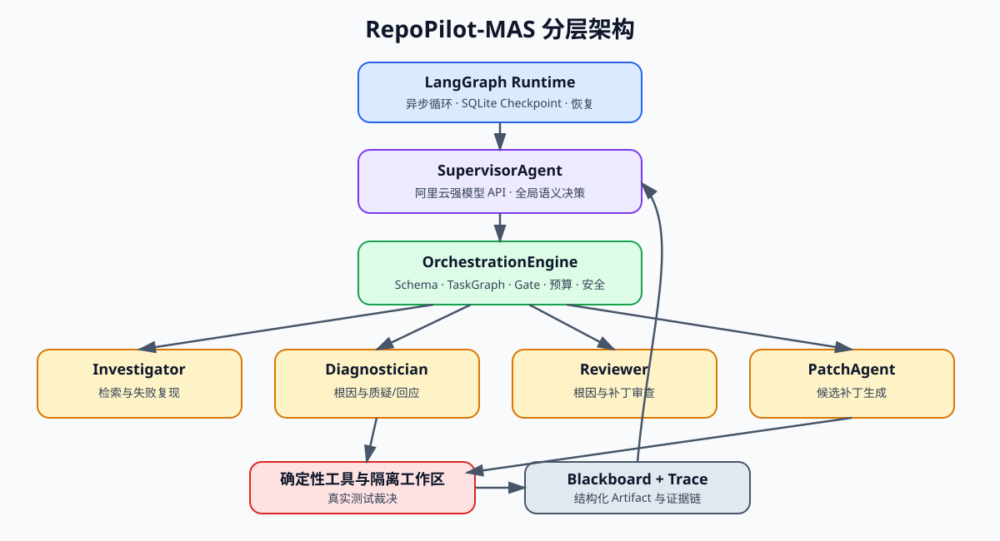

# RepoPilot-MAS

基于 API Supervisor、动态任务图与确定性验证的多智能体代码修复系统。Phase 0～Phase 5 与 Phase 6 历史基线 v1 已完成；闭环加固 v2 的实现与本地回归已完成，三模型六槽位迁移后等待重新预冻结与正式验收。阶段状态和验收口径以 `docs/RepoPilot-MAS_完整计划.md` 为唯一基线。

下文的冻结结果和简历数字均来自历史运行 `phase6_quixbugs_final_v1`。当前分支不能沿用该运行证明加固 v2 已验收；v2 还必须重新通过完整 Development、冻结身份、Frozen Test 和独立审计。



## 为什么不是固定 Agent 流水线

Single-Agent 容易沿单一推理路径形成错误归因；固定多角色流水线又会在简单任务上无条件支付全部成本。RepoPilot-MAS 从最小任务图开始，由 SupervisorAgent 根据结构化 Evidence、风险和验证结果决定是否扩展 Investigation、Diagnosis、Challenge、Review 或第二个 Patch。

系统把职责明确拆开：

- `SupervisorAgent`：阿里云强模型 API，负责全局语义规划和选择；
- `OrchestrationEngine`：确定性状态、动态 TaskGraph、Gate、预算和安全约束；
- `Investigator / Diagnostician / Reviewer / PatchAgent`：本地 Qwen3-8B 专业 Worker，只返回结构化 Artifact；
- `LangGraph Runtime`：异步执行循环、SQLite Checkpoint、恢复和人工介入；
- 确定性工具层：在隔离候选工作区应用 Patch，以真实测试而非模型自评裁决成功。

Worker 不能修改全局任务图；Supervisor 不能直接执行文件或进程操作；最终成功必须绑定目标测试、完整回归、静态检查和受保护路径检查全部通过的 `ValidationResult`。

## 已实现能力

- 动态任务图、条件扩展、Fork–Join、取消、重试和一次定向重规划；
- 版本化 Blackboard 与 Evidence/Hypothesis/Challenge/Rebuttal/Patch/Validation Artifact；
- 双向 Challenge/Rebuttal、Reviewer 建议和双 Patch 竞争；
- 九个路径受限、命令受信、超时和输出有界的确定性工具；
- 双 GPU 本地 WorkerPool、显式模型释放和任务级隔离工作区；
- 阿里云三模型×双账号六槽位路由，区分额度耗尽、限流和配置错误；
- JSONL Trace、原始响应引用、Token/调用/时延和机制指标；历史 v1 保留冻结等价成本证据；
- development/test 隔离的 QuixBugs 批量评测与独立审计。

## 快速开始

要求 Python 3.10 或更高版本。当前服务器使用：

```bash
conda activate multi_agent
python -m pip install -e ".[dev,model]"
```

配置 Supervisor 凭据：

```bash
cp .env.example .env.supervisor
chmod 600 .env.supervisor
```

只在 `.env.supervisor` 中填写真实 Key。该文件被 `.gitignore` 忽略，配置、Trace、报告和 Checkpoint 只记录 `DASHSCOPE_API_KEY_1/2` 名称。

运行单个 development 任务：

```bash
python scripts/run_phase6_evaluation.py \
  --split development \
  --systems dynamic_hybrid \
  --task-id quixbugs_gcd
```

运行完整冻结评测和独立审计：

```bash
python scripts/run_phase6_evaluation.py \
  --run-id phase6_quixbugs_final_v1
python scripts/audit_phase6_evaluation.py \
  --run-root reports/phase6/evaluation/phase6_quixbugs_final_v1
```

完整批次会真实调用 API 和本地模型，耗时较长。开发时必须使用 `--split development`；只有完整 test split × 五系统运行才能通过最终评测门。

## 冻结评测结果

数据集为 10 个未参与 Phase 6 调试的 [QuixBugs Python](https://github.com/jkoppel/QuixBugs/tree/4257f44b0ff1181dedaedee6a447e133219fcebf) 任务，固定 seed=0。失败、超时和预算耗尽全部保留在分母中。


| 系统 | 解决数 | Token | API 调用 | 中位时延 | 等价 API 成本 |
| --- | ---: | ---: | ---: | ---: | ---: |
| Local Single-Agent | 1/10 | 389,473 | 0 | 47,893 ms | ¥0 |
| Fixed Hybrid | 2/10 | 306,831 | 5 | 99,339 ms | ¥0.503904 |
| Dynamic Hybrid | 7/10 | 887,520 | 75 | 245,337 ms | ¥8.940828 |
| No Second Diagnostician | 6/10 | 978,324 | 79 | 276,847 ms | ¥9.471288 |
| No Challenge/Rebuttal | 6/10 | 1,020,534 | 79 | 255,327 ms | ¥8.985158 |

Dynamic Hybrid 在这个小型固定协议内完成更多任务，但也更慢、更贵。Local 与 Dynamic 的比较包含 Supervisor 模型能力差异，只能作为部署对比。两个消融均实际执行了约束，但主系统本次也没有触发第二 Diagnostician 或有效 Challenge，因此 7/10 与 6/10 的差异不能解释为对应机制的因果收益。

完整解释见 `docs/Phase6_评测观测与简历交付.md`，机器可读结果见 `reports/phase6/results_summary.json` 和 `reports/phase6/final_audit.json`。

## 典型 Trace

- 真实 Dynamic fast 成功路径：`reports/phase6/demo_traces/dynamic_hybrid_quixbugs_bucketsort.jsonl`；
- 真实 Fixed Worker 并行：`reports/phase6/demo_traces/fixed_hybrid_quixbugs_bucketsort.jsonl`；
- 真实验证失败与重规划：`reports/phase6/demo_traces/dynamic_hybrid_quixbugs_flatten.jsonl`；
- 真实非法 Supervisor 决策被 Engine 拒绝：`reports/phase6/demo_traces/dynamic_hybrid_quixbugs_get_factors.jsonl`；
- Phase 5 质疑修订、错误 Patch 淘汰与简单路径：`reports/phase5/acceptance/20260802T033236637083Z/`。

统一索引见 `reports/phase6/trace_index.json`。Phase 5 固定认知输出证明机制可达性；Phase 6 真实模型结果用于效果评测，两类证据不混用。

## 验证

```bash
/home/user50305/.conda/envs/multi_agent/bin/python -m pytest
/home/user50305/.conda/envs/multi_agent/bin/python -m ruff check .
git diff --check
```

历史 Phase 6 v1 最终验收环境中全量 `130 passed`。当前闭环加固 v2 在 `multi_agent` 环境中通过全量 `239 tests`、Ruff、compileall 与 `git diff --check`，但这些代码检查不能代替尚未运行的完整 Development 和 Frozen Test。正式 Development 前还必须在提交运行时代码后执行 `python -m scripts.run_phase6_pre_freeze_checks`，dirty tree 会失败关闭。

## 当前限制

- 仅评测 10 个小型 Python 算法任务和一个 seed，没有显著性检验；
- 真实 Dynamic 运行的有效 Challenge 为 0，3 次重规划均未恢复成功；
- Dynamic 只有 1 对 Worker 时间重叠，不能宣称并行加速；
- 尚未运行 SWE-bench Verified、SWE-Gym Lite、Java 或 C 项目；
- 不是容器级不可信代码沙箱，也没有多用户队列和前端平台。

## 文档

- 唯一计划基线：`docs/RepoPilot-MAS_完整计划.md`；
- Phase 6 设计与结果：`docs/Phase6_评测观测与简历交付.md`；
- Phase 6 验收报告：`docs/Phase6_验收报告.md`；
- 闭环加固 v2 修复计划：`docs/RepoPilot-MAS闭环评测异常修复计划_修订版.md`；
- 闭环加固 v2 完成性审计：`docs/Phase6_闭环加固v2完成性审计.md`；
- 真实框架问题复盘：`docs/Phase6_真实问题复盘与排障.md`；
- 面试讲解与简历表述：`docs/Phase6_面试讲解.md`；
- Phase 1～Phase 5 的设计和验收报告均位于 `docs/`。
