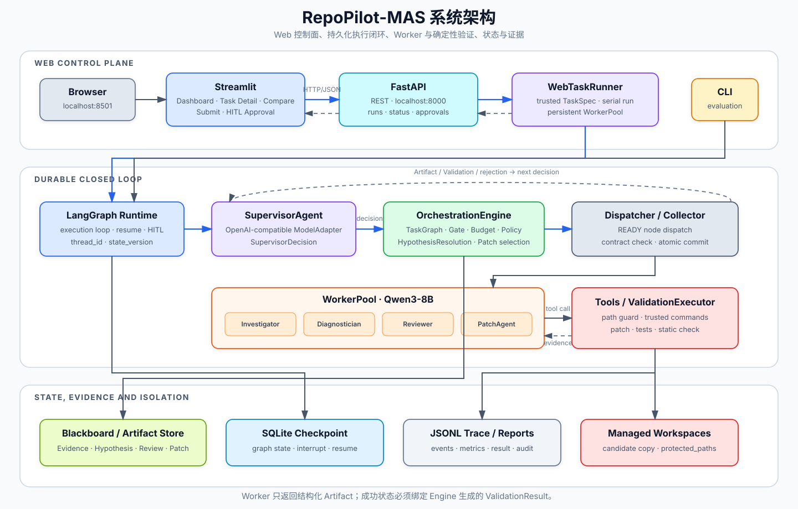
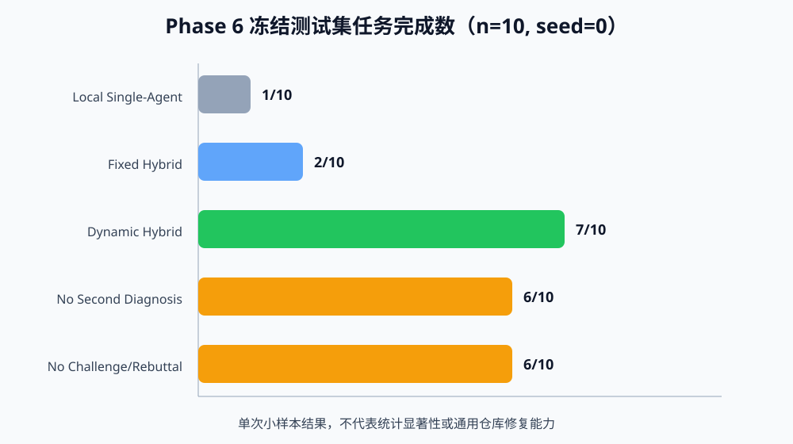

# RepoPilot-MAS

RepoPilot-MAS 是面向 Python 代码修复任务的分层多智能体系统。`SupervisorAgent` 负责生成结构化决策，`OrchestrationEngine` 负责 TaskGraph、状态迁移、预算和安全约束，专业 Worker 负责检索、诊断、审查与 Patch 生成，最终结果由受信测试和静态检查裁决。

当前分支已经实现根因确认、Patch 审查、Validation 闭环以及 Streamlit/FastAPI 控制面。闭环加固版本的正式冻结评测仍在进行，阶段状态与验收口径以 [完整计划](docs/RepoPilot-MAS_完整计划.md) 为准。

## 快速开始

### 1. 克隆与安装

要求：

- Python 3.10 或更高版本；
- 本地 Qwen3-8B 权重；
- CUDA 环境。当前 `configs/model.yaml` 使用两块 GPU，部署前需要按实际设备修改；
- `configs/supervisor.yaml` 所引用模型服务的 API Key。

```bash
git clone --branch agent/hypothesis-patch-closed-loop \
  https://github.com/yyy602/repo-pilot-mas.git
cd repo-pilot-mas

conda create -n repo-pilot-mas python=3.11 -y
conda activate repo-pilot-mas
python -m pip install --upgrade pip
python -m pip install -e ".[dev,model,visualization]"
```

### 2. 配置模型与凭据

Linux/macOS：

```bash
cp .env.example .env.supervisor
chmod 600 .env.supervisor
```

PowerShell：

```powershell
Copy-Item .env.example .env.supervisor
```

然后完成两项配置：

1. 在 `.env.supervisor` 中填写 `configs/supervisor.yaml` 引用的环境变量；
2. 在 `configs/model.yaml` 中修改 Qwen3-8B 的 `model_path`、`device` 和 `dtype`。

`.env.supervisor` 已被 Git 忽略。API Key 不应写入 YAML、Trace、Checkpoint 或报告。

### 3. 启动 Web 控制面

从仓库根目录打开两个终端。

终端 1，启动 FastAPI 和常驻 `WebTaskRunner`：

```bash
conda activate repo-pilot-mas
python -m repo_pilot_mas.visualization.server
```

终端 2，启动 Streamlit：

```bash
conda activate repo-pilot-mas
streamlit run src/repo_pilot_mas/visualization/app.py \
  --server.headless true \
  --server.port 8501
```

浏览器打开 [http://localhost:8501](http://localhost:8501)。FastAPI 默认监听 `http://127.0.0.1:8000`，可以用下面的命令检查服务状态：

```bash
curl http://127.0.0.1:8000/health
```

只查看已有 `reports/` 时可以单独启动 Streamlit；从页面提交任务、查询运行状态或处理人工审批时，两个进程都需要运行。首次提交任务时服务会加载本地模型。

## 系统架构



| 边界 | 代码位置 | 职责 |
| --- | --- | --- |
| Web 控制面 | `visualization/app.py`、`service.py`、`runner.py` | 运行浏览、任务提交、状态轮询和 HITL 审批 |
| 持久化运行时 | `orchestration/final_runtime.py` | LangGraph 执行环、Dispatcher/Collector、SQLite Checkpoint 和恢复 |
| 确定性编排 | `orchestration/closed_loop_engine.py` | TaskGraph、Gate、预算、状态迁移和策略拒绝 |
| Agent 与模型 | `agents/`、`models/` | OpenAI-compatible Supervisor、Qwen3-8B WorkerPool 和结构化输出 |
| 状态与协议 | `state/`、`schemas/` | Blackboard、Artifact、`HypothesisResolution`、`SupervisorDecision` 和 `TaskSpec` |
| 工具与隔离 | `tools/`、`runtime/` | 路径约束、受信命令、候选工作区、Patch 应用和 Validation |

核心执行环如下：

1. `TaskSpec` 定义任务仓库、测试命令、预算和 `protected_paths`；
2. `SupervisorAgent` 输出 `SupervisorDecision`，Engine 校验 Schema、引用、阶段、预算和动作合法性；
3. LangGraph Dispatcher 只派发 Engine 标记为 `READY` 的节点，Collector 校验并提交 Worker Artifact；
4. Evidence 进入 Hypothesis、Reviewer 技术审查和 `ACCEPT_HYPOTHESIS` Gate，Engine 将结果记录为 `HypothesisResolution`；
5. `PatchAgent` 只能基于已接受根因生成 Patch，Patch 通过 Reviewer 与策略 Gate 后才能进入 Validation；
6. 确定性工具在受管候选工作区应用 Patch，执行目标测试、回归测试、静态检查和受保护路径检查；
7. Blackboard、JSONL Trace、SQLite Checkpoint 和报告保存每次决策、Artifact、拒绝、恢复与验证结果。

## 已实现能力

- LangGraph 持久化执行、动态 TaskGraph、Fork–Join、重试、定向重规划和 HITL；
- `SupervisorDecision`、Agent 输入契约和 Artifact Schema 校验；
- Investigator、Diagnostician、Reviewer、PatchAgent 与本地 Qwen3-8B WorkerPool；
- Hypothesis 审查/接受、Challenge/Rebuttal、Patch Review、Patch 选择和 Validation Gate；
- 九个路径受限、命令受信、超时和输出有界的确定性工具；
- 任务级候选工作区、`protected_paths` 检查和真实测试裁决；
- Blackboard、SQLite Checkpoint、JSONL Trace、Token/调用/时延和机制指标；
- Streamlit 运行面板、FastAPI 服务、受信任务提交、运行对比和人工审批。

## Web 页面

- **仪表盘**：运行列表与失败类别分布；
- **任务详情**：TaskGraph 状态回放、节点时间线、Supervisor 决策、Artifact、Patch diff 和模型调用；
- **对比**：多个运行的任务结果与资源使用对比；
- **运行任务**：提交 `data/quixbugs/tasks/*.json` 中的受信任务并轮询状态；
- **审批队列**：查看挂起决策并批准或拒绝，任务通过同一 Checkpoint 恢复。

Web 运行写入 `reports/web_runs/`，与正式评测目录和冻结身份隔离。接口说明见 [可视化驾驶舱使用说明](docs/Phase7_可视化驾驶舱使用说明.md)。

## 命令行调试

不经过 Web 页面时，可以运行一个 development 任务：

```bash
python scripts/run_closed_loop_final_evaluation.py \
  --split development \
  --task-id quixbugs_gcd \
  --supervisor-config configs/supervisor.local.yaml \
  --run-id local_debug_gcd
```

`configs/supervisor.local.yaml` 用于本地闭环调试，不能生成正式评测结论。完整 Development、Frozen Test 和独立审计需要绑定预冻结检查与同一提交，命令见 [闭环加固完成性审计](docs/Phase6_闭环加固v2完成性审计.md)。

## Phase 6 评测记录

下面是历史运行 `phase6_quixbugs_final_v1` 在 10 个 QuixBugs Python 任务、固定 `seed=0` 下的结果。失败、超时和预算耗尽均保留在分母中；该结果不代表当前闭环加固版本已经完成冻结验收。



| 系统 | 解决数 | Token | API 调用 | 中位时延 |
| --- | ---: | ---: | ---: | ---: |
| Local Single-Agent | 1/10 | 389,473 | 0 | 47,893 ms |
| Fixed Hybrid | 2/10 | 306,831 | 5 | 99,339 ms |
| Dynamic Hybrid | 7/10 | 887,520 | 75 | 245,337 ms |
| No Second Diagnostician | 6/10 | 978,324 | 79 | 276,847 ms |
| No Challenge/Rebuttal | 6/10 | 1,020,534 | 79 | 255,327 ms |

Dynamic Hybrid 在这组任务中完成数更高，同时 API 调用和时延也更高。Local 与 Dynamic 使用的 Supervisor 模型不同，因此只能作为部署配置对比；两个消融结果也不能直接解释为对应机制的因果收益。详细口径见 [Phase 6 评测说明](docs/Phase6_评测观测与简历交付.md)。

## 目录

```text
configs/                    模型、Supervisor、Runtime 与评测配置
data/quixbugs/              任务清单、Development/Test split 与冻结源码
docs/                       设计、验收、评测和使用说明
reports/                    Trace、Checkpoint、评测与 Web 运行产物
scripts/                    单任务、评测、预冻结和审计入口
src/repo_pilot_mas/
  agents/                   Supervisor 与四类 Worker
  models/                   ModelAdapter 与模型工厂
  orchestration/            Engine、TaskGraph 与 LangGraph Runtime
  schemas/                  Task、Decision、Artifact 与结果协议
  state/                    Blackboard 与 Checkpoint
  tools/                    确定性工具
  runtime/                  路径、子进程、Trace 与工作区
  visualization/            Streamlit、FastAPI、Runner 与报告解析
tests/                      单元、失败路径、边界与验收测试
```

## 验证

```bash
python -m pytest
python -m ruff check .
git diff --check
```

## 当前边界

- 公开评测记录只覆盖 10 个 QuixBugs Python 任务和一个 seed，没有显著性检验；
- 当前 Web Runner 只接受受信 QuixBugs TaskSpec，任务在单机进程内串行执行；
- 服务默认绑定 `127.0.0.1`，没有多用户、认证、权限和生产级任务队列；
- 候选工作区提供路径与命令约束，但不是容器级不可信代码沙箱；
- 尚未完成 SWE-bench Verified、SWE-Gym Lite、Java 或 C 项目评测。

## 文档

- [完整计划（唯一基线）](docs/RepoPilot-MAS_完整计划.md)
- [根因确认与 Patch 闭环改造](docs/根因确认与Patch闭环改造计划.md)
- [可视化驾驶舱使用说明](docs/Phase7_可视化驾驶舱使用说明.md)
- [闭环加固 v2 完成性审计](docs/Phase6_闭环加固v2完成性审计.md)
- [Phase 6 评测、观测与简历交付](docs/Phase6_评测观测与简历交付.md)
- [Phase 6 真实问题复盘](docs/Phase6_真实问题复盘与排障.md)
